# 网络请求
### OSI七层模型
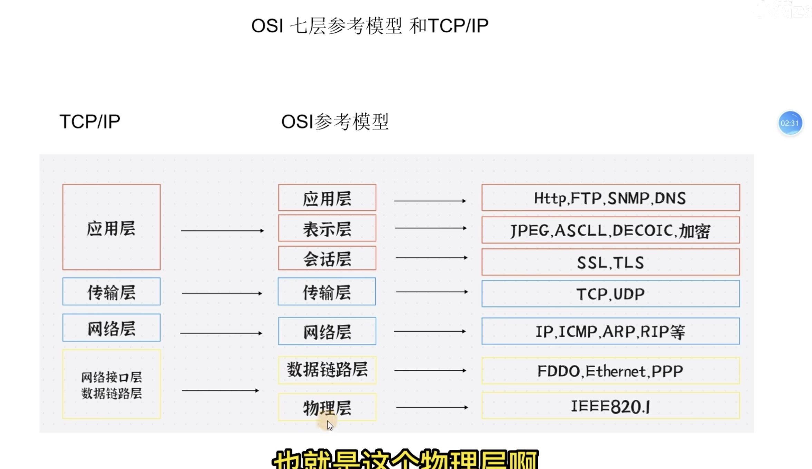
物理层传输比特流，单位是bit；
数据链路层进行逻辑连接，进行硬件地址寻址等，由底层网络协议组成，将比特币组合成字节进而组合成帧，用MAC地址访问介质（MAC地址：每个网卡的唯一标识）；
网络层：依靠IP地址进行相互通信，使用IP地址来唯一标识互联网上的设备；路由（在同一个网络的内部通信不需要网络层设备，对不同网络层之间需要借助路由器等三层设备）
传输层：定义端口号，拥有TCP，UDP两个协议
会话层：是发送方和接收方进行通信时产生连接的地方，定义了一种机制，允许两方启动或者停止对话，以及当双方发生拥塞时仍能保持对话；包含了一种称为检查点（Checkpoint）的机制来维持可靠对话，检查点定义了一个最接近成功通信的点，并且定义了当发生内容丢失或者损坏时需要回滚以便修复丢失或者损坏的点，即断点下载的原理，这一层常被称为报文；
表示层：在数据发送前进行加密，接受时进行解码；
应用层：Ajax调接口发送http请求，webSocket长连接，SSH协议等，报文；
### TCP三次握手与四次挥手
```
seq：随机生成的序列号
ack：确认号，ack=seq+1
ACK：确定序列号有效
SYN：发起新连接
FIN：完成
```
三次握手流程：客户端发送SYN建立连接，发送Seq到服务端；服务端接收这个Seq并定义Ack=Seq（客户端传过来的）+1，同时产生一个新的Seq；客户端通过算法获得第一次发送给服务端的Seq并使Seq（新）=Seq+1，Ack=Seq（服务端传过来的）+1；以此来判断是否连接正确
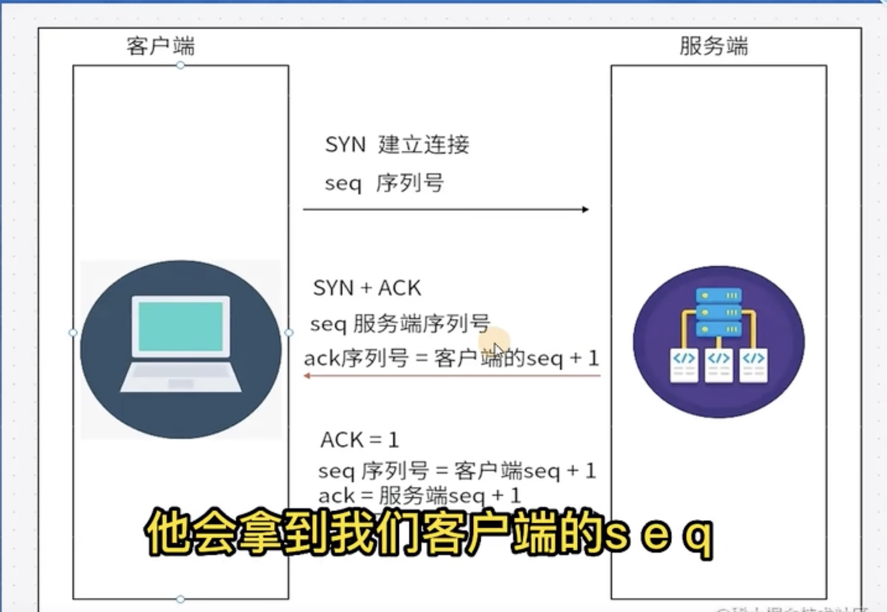

四次挥手流程：两方都可以发出，下面以客户端发出为例：
首先客户端发送FIN请求和seq=u值，进入WAIT_1状态；服务端接收到后产生ack=seq（u）+1，发送给客户端，客户端进入WAIT_2状态，服务端进入WAIT状态，剩余的未完成的请求会在这个时候全部完成；服务端产生seq（服务端）=w，发送ack=seq（u）+1；客户端接收到并进入超时等待状态，这里的超时等待可以避免服务端一直没有关闭服务的情况，发送seq=u+1，ack=w+1到服务端，此时服务端再close；
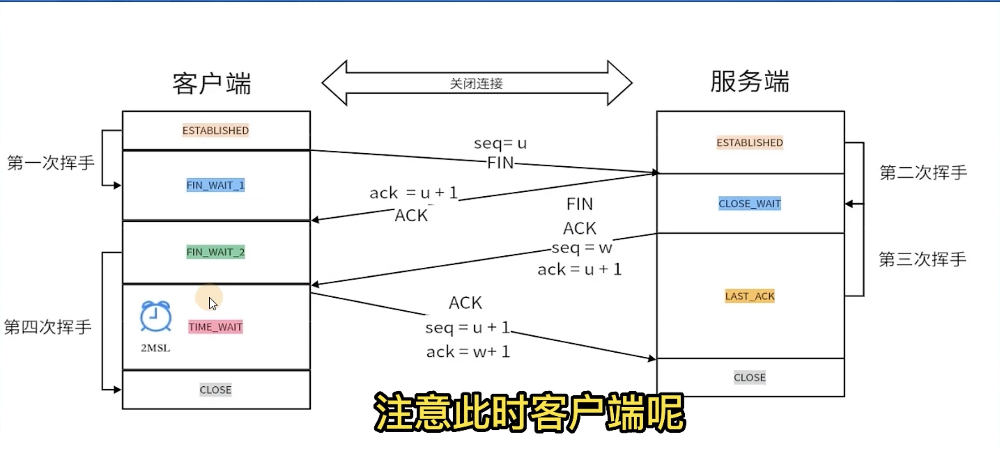
### URL
```
http：//www.server.com/dir1/file1.html
http:访问协议
www.server.com：服务器名称（域名）
dir1/file1.html：请求文件（资源）的路径
```
DNS：把IP和域名做了映射，方便我们通过服务器来找到对应的IP，获取资源
DNS的访问顺序是
1.先从本地缓存中查找（浏览器缓存，而后操作系统缓存）；
如果本地没有缓存，系统会将查询请求发送到本地配置的DNS服务器，此后的查询任务完全委托给这台递归解析器：
2.根域名服务器，
3.顶级域名服务器，
4.权威域名服务器
出现options预检请求的方式：
1.跨域问题
2.自定义请求
触发回流与重绘：
回流是RenderTree中的部分元素或者全部元素的尺寸，结构或者摩羯属性发生改变时，浏览器重新渲染部分或者全部文档的过程
重绘是当页面中元素样式的改变不影响他在文档流中的位置时，浏览器会重新将样式赋予元素并重新绘制它
所以回流一定引起重绘，重绘不一定引起回流
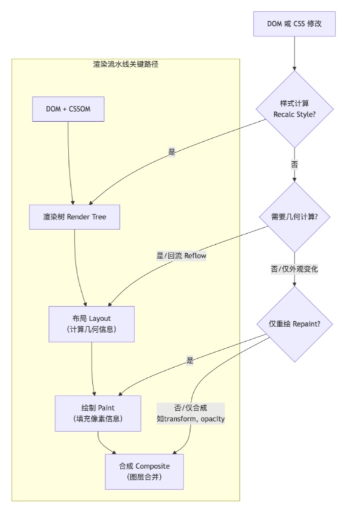
### CDN内容分发网络
CDN的全称是Content Delivery Network，即内容分发网络。由于CDN是为加快网络访问速度而被优化的网络覆盖层，因此被形象地称为“网络加速器”。
CDN可以加快用户访问网络资源的速度和稳定性，减轻源服务器的访问压力。
实现方法： 通过在网络各处放置节点服务器所构成的在现有的互联网基础之上的一层智能虚拟网络，CDN系统能够实时地根据网络流量和各节点的连接和负载状况以及到用户的距离和响应时间等综合信息将用户的请求重新导向离用户最近的服务节点上，加快访问速度。
### 跨域+解决办法
出于浏览器的同源策略（请求的时候拥有相同的协议，域名，端口，只要有一个不同就属于跨域）限制，浏览器会拒绝跨域请求；
1.前后端协商jsonp
服务端 Node.js
```js
// server.js
const http = require('http');
const url = require('url');

const server = http.createServer((req, res) => {
  const parsedUrl = url.parse(req.url, true);
  
  if (parsedUrl.pathname === '/api/data') {
    const { callback } = parsedUrl.query;
    
    // 要返回的数据
    const data = { 
      name: '张三', 
      age: 25, 
      city: '北京' 
    };
    
    // JSONP核心：用回调函数包裹JSON数据
    const jsonpResponse = `${callback}(${JSON.stringify(data)})`;
    
    res.writeHead(200, { 
      'Content-Type': 'application/javascript',
      'Access-Control-Allow-Origin': '*' // 实际JSONP不需要这个
    });
    res.end(jsonpResponse);
  } else {
    res.writeHead(404);
    res.end('Not Found');
  }
});

server.listen(3000, () => {
  console.log('JSONP服务器运行在 http://localhost:3000');
});
```
前端
```html
<!DOCTYPE html>
<html>
<head>
    <title>JSONP示例</title>
</head>
<body>
    <button onclick="fetchData()">获取数据</button>
    <div id="result"></div>

    <script>
        // 全局回调函数
        function handleResponse(data) {
            document.getElementById('result').innerHTML = `
                <p>姓名: ${data.name}</p>
                <p>年龄: ${data.age}</p>
                <p>城市: ${data.city}</p>
            `;
            console.log('收到数据:', data);
        }
        
        // JSONP请求函数
        function fetchData() {
            // 创建script标签
            const script = document.createElement('script');
            
            // 设置src，包含回调函数名
            script.src = 'http://localhost:3000/api/data?callback=handleResponse';
            
            // 添加到DOM中（此时浏览器会自动请求并执行返回的JS代码）
            document.body.appendChild(script);
            
            // 请求完成后移除script标签
            script.onload = function() {
                document.body.removeChild(script);
            };
        }
    </script>
</body>
</html>
```
2.前端解决，使用代理dev
配置proxy,只对开发环境有效
```ts
//vite.config.ts
import {defineConfig} from 'vite'
export default defineConfig({
    server:{
        proxy:{
            '/api':{
                target:'http://localhost:3000',
                changeOrigin:true,
            }
        }
    }
})
```
3.后端解决，设置请求头
```js
// 安装cors中间件：npm install cors
const express = require('express');
const cors = require('cors'); // 引入cors包
const app = express();

// 方法A：全局启用，允许所有来源（最简单，适合开发）
app.use(cors()); // 默认配置：允许所有来源、所有方法

// 方法B：自定义配置（推荐用于生产）
const corsOptions = {
  origin: 'http://localhost:3000', // 允许的前端域名
  methods: ['GET', 'POST', 'PUT', 'DELETE'], // 允许的HTTP方法
  allowedHeaders: ['Content-Type', 'Authorization'], // 允许的请求头
  credentials: true, // 允许发送Cookie
  maxAge: 86400 // 预检请求缓存时间(秒)
};
app.use(cors(corsOptions));

// 方法C：针对单个路由启用
app.get('/api/data', cors(corsOptions), (req, res) => {
  res.json({ message: '允许跨域的数据' });
});

// 方法D：手动设置响应头（不依赖中间件）
app.get('/api/manual', (req, res) => {
  // 设置CORS头
  res.setHeader('Access-Control-Allow-Origin', 'http://localhost:3000');
  res.setHeader('Access-Control-Allow-Methods', 'GET, POST, OPTIONS');
  res.setHeader('Access-Control-Allow-Headers', 'Content-Type');
  res.json({ message: '手动设置CORS头' });
});

app.listen(3001, () => console.log('Server running on port 3001'));
```
4.运维端解决，nginx代理
安装nginx之后配置location
```nginx
# 在 nginx.conf 或站点配置中
server {
    listen 80;
    server_name api.example.com;
    
    location / {
        # 处理预检请求 (OPTIONS)
        if ($request_method = 'OPTIONS') {
            add_header 'Access-Control-Allow-Origin' 'https://frontend.example.com';
            add_header 'Access-Control-Allow-Methods' 'GET, POST, OPTIONS, PUT, DELETE';
            add_header 'Access-Control-Allow-Headers' 'DNT,User-Agent,X-Requested-With,If-Modified-Since,Cache-Control,Content-Type,Range,Authorization';
            add_header 'Access-Control-Allow-Credentials' 'true';
            add_header 'Access-Control-Max-Age' 1728000; # 20天缓存
            add_header 'Content-Type' 'text/plain; charset=utf-8';
            add_header 'Content-Length' 0;
            return 204; # 空响应
        }
        
        # 处理实际请求
        add_header 'Access-Control-Allow-Origin' 'https://frontend.example.com' always;
        add_header 'Access-Control-Allow-Methods' 'GET, POST, OPTIONS, PUT, DELETE' always;
        add_header 'Access-Control-Allow-Headers' 'DNT,User-Agent,X-Requested-With,If-Modified-Since,Cache-Control,Content-Type,Range,Authorization' always;
        add_header 'Access-Control-Allow-Credentials' 'true' always;
        
        # 代理到后端应用
        proxy_pass http://backend_server;
        proxy_set_header Host $host;
        proxy_set_header X-Real-IP $remote_addr;
    }
}
```
### fetch
使用起来比XMLHGttpRequest更简单，只是不能设置超时时间，并且在取消请求的时候需要使用构造函数
get请求
```html
    <script>
        const btn = document.querySelector("#send")
        const sendFetch=() =>{
            //第一个参数是url，默认请求方式get，返回值是Promise对象
            fetch('http://localhost:3000/api/txt').then(res=>{
                console.log(res)
                //指定返回的方式，默认是json
                return res.text()
            }).then(data=>{
                console.log(data)
            })
        }
    </script>
```
post请求
```html
    <script>
        const btn = document.querySelector("#send")
        const sendFetch=() =>{ 
            //发送一个post请求
            fetch('http://localhost:3000/api/post',{
                method:'POST',
                headers:{
                    'Content-Type':'application/json'
                },
                body:JSON.stringify({
                    name:'zhangsan',
                    age:18
                })
            }).then(res=>{
                console.log(res)
                //指定返回的方式，默认是json
                return res.json()
            }).then(data=>{
                console.log(data)
            })
        }
    </script>
```
### SSE（Server-Sent Event）
是一种用于实现服务器主动向客户端推送技数据的技术，也被称为“事件流”，他基于HTTP协议，利用其长连接特性，在客户端与服务器之间建立一条持久化连接，并通过这条连接实现服务器向客户端的实时数据推送。
属于单工通讯
后端
```js
    <script>
        const btn = document.querySelector("#send")
        const sendFetch=() =>{
            //第一个参数是url，默认请求方式get，返回值是Promise对象
            //发送一个post请求
            // fetch('http://localhost:3000/api/txt').then(res=>{
            //     console.log(res)
            //     //指定返回的方式，默认是json
            //     return res.text()
            // }).then(data=>{
            //     console.log(data)
            // })
            fetch('http://localhost:3000/api/post',{
                method:'POST',
                headers:{
                    'Content-Type':'application/json'
                },
                body:JSON.stringify({
                    name:'zhangsan',
                    age:18
                })
            }).then(res=>{
                console.log(res)
                //指定返回的方式，默认是json
                return res.json()
            }).then(data=>{
                console.log(data)
            })
        }
    </script>
```
前端
```html
<!-- client.html -->
<script>
  const eventSource = new EventSource('http://localhost:3000/sse');
  
  eventSource.onmessage = (event) => {
    const data = JSON.parse(event.data);
    console.log('收到消息:', data);
  };
</script>
```
### Web Socket
```js
// websocket-server.js
const WebSocket = require('ws');
const wss = new WebSocket.Server({ port: 8080 });

wss.on('connection', (ws) => {
  console.log('客户端已连接');
  
  // 接收客户端消息
  ws.on('message', (message) => {
    console.log('收到消息:', message.toString());
  });
  
  // 每秒发送消息
  setInterval(() => {
    ws.send(JSON.stringify({
      time: new Date().toISOString(),
      message: '服务器消息'
    }));
  }, 1000);
});
```
```html
<!-- websocket-client.html -->
<script>
  const ws = new WebSocket('ws://localhost:8080');
  
  // 连接成功
  ws.onopen = () => {
    console.log('WebSocket 连接已建立');
    ws.send('Hello Server!');
  };
  
  // 接收消息
  ws.onmessage = (event) => {
    const data = JSON.parse(event.data);
    console.log('收到消息:', data);
  };
</script>
```
### 心跳检测
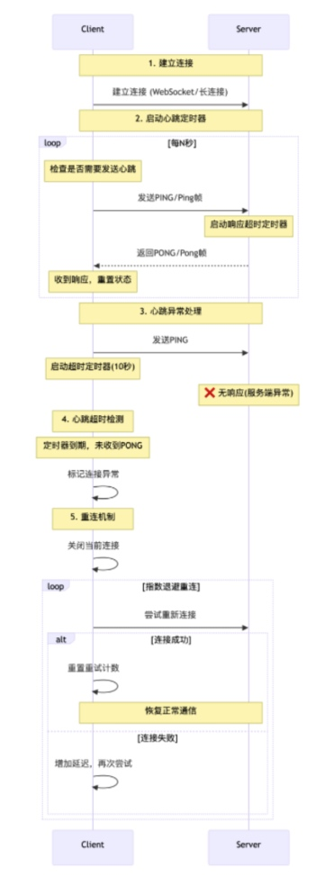
### navigator.sendBeacon
1.发送心跳包
2.埋点：在页面关闭或卸载时记录用户的在线时间，pv，uv，以及错误日志上报，按钮点击次数等。
3.发送用户反馈
优点：
1.不受页面卸载过程的影响
2.异步执行，不阻塞页面关闭
3.能够发送跨域请求
使用html5新增的并且是sendBeacon特有的ping请求，只能携带少量数据，不需要等待服务端响应，所以非常适合做埋点统计；
### JWT(json web token)
是做鉴权用的，在登录之后存储用户的信息

# Node.js
Node.js其实是基于V8引擎的JavaScript运行环境，在这个后端运行环境中就可以将JavaScript解析成为后端代码。
# project
## SmartPark
### 1.项目环境配置
本项目使用vite脚手架，react-ts编程，我们先安装好脚手架
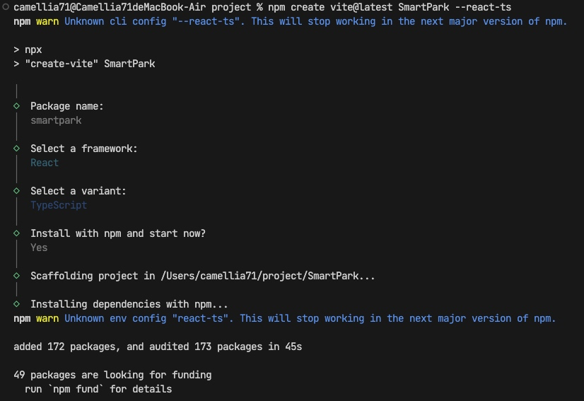
```
生产依赖与开发依赖：
1.生产依赖：是指在项目上线时需要用到的依赖，写在dependencies中
2.开发依赖：是指在本地开发时使用，项目上线时不需要的依赖
```
路由配置：react-router-dom
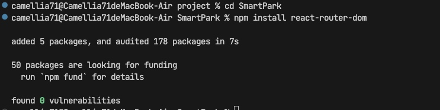
UI组件库安装：antd
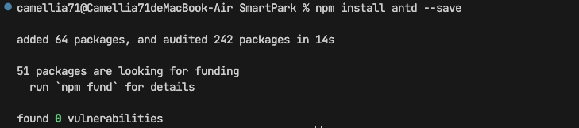
在dependencies中看到下方内容即安装完成
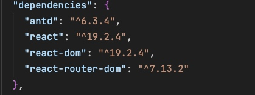
模拟后端接口：mockjs
优点：调用方式与真实的后端接口完全相同，是纯前端项目的好搭子
安装：
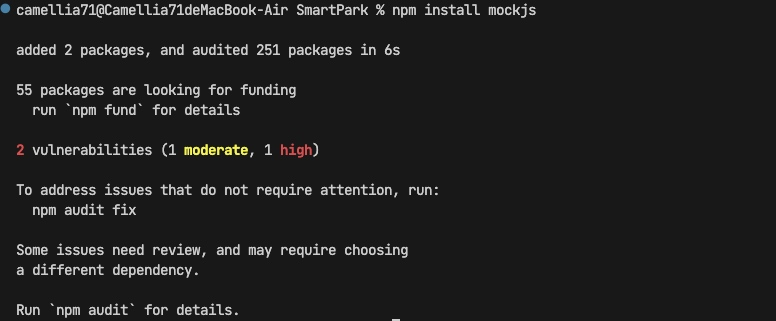
前后端交流的工具：Axios
Axios是一个基于Promise封装的http库，可以用于浏览器和node.js中，其实就是通过Promise实现对Ajax技术的一种封装

### 2.login页面


接口请求数据检查
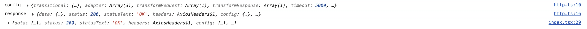


浏览器历史记录栈
浏览器维护着一个历史记录栈（history stack），记录用户访问过的页面：
```tsx
访问顺序: 登录页 → 主页
历史记录栈: [登录页, 主页]  ← 当前位于主页
```
可以按"返回"按钮回到登录页
当使用 replace: true时：
```tsx
// 假设当前在登录页，用户登录成功后
navigate('/', { replace: true });

// 效果：
// 历史记录栈: [主页]  ← 用主页"替换"了登录页
// 而不是：[登录页, 主页]
```


## SmartPark 智慧园区管理平台 - 项目介绍
项目名称 : SmartPark 智慧园区管理平台
 技术栈 : React 19 + TypeScript + Vite + Redux Toolkit + Ant Design + React Router v7
 项目描述 : 一个面向智慧园区的综合性管理平台,实现了园区运营、租户管理、物业管理、财务管理、设备运维等核心业务模块,为园区管理者提供智能化、数字化的管理解决方案。
 
 我为SmartPark项目设计了以下100个面试问题，覆盖基础知识、React技术栈、项目架构等多个方面：

### 基础知识
1. 请解释HTML5的语义化标签及其在SmartPark项目中的应用场景
2. 如何在CSS中实现响应式布局？SmartPark项目中是如何处理不同设备适配的？
3. 解释JavaScript中的闭包概念，并举例说明在SmartPark项目中可能的应用
4. TypeScript相比JavaScript有哪些优势？SmartPark项目中使用了哪些TypeScript特性？
5. 请解释ES6中的箭头函数、解构赋值和模板字符串，并说明它们在SmartPark项目中的应用
6. 如何优化CSS选择器的性能？SmartPark项目中是否有相关实践？
7. 解释浏览器的渲染原理，以及如何优化页面加载性能
8. 请描述JavaScript的事件循环机制，以及它对前端开发的影响
9. 如何实现CSS动画？SmartPark项目中是否使用了动画效果？
10. 解释HTTP协议的缓存机制，以及在SmartPark项目中如何利用缓存提升性能

### React核心概念
11. 请解释React的虚拟DOM原理及其优势
12. 什么是React组件的生命周期？SmartPark项目中如何使用生命周期方法？
13. 请解释React Hooks的概念，以及SmartPark项目中使用了哪些Hooks？
14. 如何理解React的状态管理？SmartPark项目中为什么选择使用Redux？
15. 请解释React中的props和state的区别，以及它们在SmartPark项目中的应用
16. 什么是React的上下文（Context）API？SmartPark项目中是否使用了它？
17. 如何实现React组件的条件渲染？SmartPark项目中有哪些场景使用了条件渲染？
18. 请解释React的key属性的作用，以及在SmartPark项目中的应用
19. 如何处理React组件的性能优化？SmartPark项目中采取了哪些优化措施？
20. 请解释React的单向数据流原理，以及它在SmartPark项目中的体现

### Redux状态管理
21. 请解释Redux的核心概念（Store、Action、Reducer）
22. SmartPark项目中如何组织Redux的状态结构？
23. 如何处理异步操作在Redux中？SmartPark项目中使用了哪些中间件？
24. 请解释Redux Toolkit的优势，以及SmartPark项目中如何使用它？
25. 如何在React组件中连接Redux状态？SmartPark项目中使用了哪些方法？
26. 如何处理Redux状态的持久化？SmartPark项目中是否实现了状态持久化？
27. 请解释Redux的不可变性原则，以及在SmartPark项目中的应用
28. 如何优化Redux的性能？SmartPark项目中采取了哪些措施？
29. 请解释Redux中的选择器（Selector）的作用，以及SmartPark项目中如何使用它们？
30. 如何处理Redux中的错误？SmartPark项目中是否有错误处理机制？

### 路由与导航
31. 请解释React Router的核心概念和使用方式
32. SmartPark项目中如何配置路由？包括嵌套路由和动态路由
33. 如何实现路由守卫（Route Guard）？SmartPark项目中的RequireAuth组件是如何实现的？
34. 请解释React Router中的导航方式，以及它们的区别
35. 如何处理路由参数？SmartPark项目中是否有相关应用？
36. 如何实现路由的懒加载？SmartPark项目中是否使用了代码分割？
37. 请解释React Router中的history对象，以及它的作用
38. 如何实现面包屑导航？SmartPark项目中的MyBreadcrumb组件是如何实现的？
39. 如何处理404页面？SmartPark项目中是否有相关配置？
40. 请解释React Router v6的新特性，以及SmartPark项目中是否使用了这些特性

### API调用与数据处理
41. 请解释Axios的基本使用方式，以及SmartPark项目中如何配置Axios实例
42. 如何处理API请求的错误？SmartPark项目中是否有统一的错误处理机制？
43. 请解释Mock.js的作用，以及SmartPark项目中如何使用它模拟API数据？
44. 如何实现API请求的拦截器？SmartPark项目中的http.ts文件是如何配置的？
45. 如何处理跨域问题？SmartPark项目中是否遇到了跨域问题？如何解决的？
46. 请解释RESTful API的设计原则，以及SmartPark项目中的API是否遵循这些原则？
47. 如何实现API请求的缓存？SmartPark项目中是否有相关实现？
48. 请解释乐观更新（Optimistic Update）的概念，以及SmartPark项目中是否使用了这种模式？
49. 如何处理大数据量的API响应？SmartPark项目中是否有相关优化措施？
50. 请解释GraphQL的概念，以及它与RESTful API的区别。SmartPark项目为什么选择使用RESTful API？

### 组件设计与开发
51. 请解释SmartPark项目中的组件结构设计原则
52. 如何设计可复用的React组件？SmartPark项目中有哪些可复用组件？
53. 请解释SmartPark项目中的NavLeft组件的实现原理
54. 如何实现表格组件的分页、排序和筛选功能？SmartPark项目中是如何处理的？
55. 请解释SmartPark项目中的DataDashboard组件的实现原理
56. 如何实现表单验证？SmartPark项目中是否使用了表单验证？
57. 请解释SmartPark项目中的TechCanvas组件的实现原理
58. 如何实现模态框（Modal）组件？SmartPark项目中是否使用了Ant Design的Modal组件？
59. 请解释SmartPark项目中的布局组件（Layout）的实现原理
60. 如何设计无障碍（Accessibility）友好的组件？SmartPark项目中是否考虑了无障碍设计？

### 性能优化
61. 请解释React中的性能优化策略，以及SmartPark项目中采取了哪些措施？
62. 如何使用React.memo、useMemo和useCallback优化组件性能？SmartPark项目中是否使用了这些优化手段？
63. 请解释代码分割（Code Splitting）的概念，以及SmartPark项目中如何实现？
64. 如何优化图片加载性能？SmartPark项目中是否有相关优化措施？
65. 请解释Webpack的构建优化策略，以及SmartPark项目中如何配置Webpack？
66. 如何优化CSS的加载性能？SmartPark项目中是否有相关优化措施？
67. 请解释虚拟滚动（Virtual Scrolling）的概念，以及SmartPark项目中是否使用了这种技术？
68. 如何优化API请求的性能？SmartPark项目中是否有相关优化措施？
69. 请解释浏览器的渲染性能优化策略，以及SmartPark项目中如何应用这些策略？
70. 如何使用Chrome DevTools分析和优化前端性能？请结合SmartPark项目举例说明

### 项目架构与设计
71. 请解释SmartPark项目的整体架构设计
72. 如何组织React项目的文件结构？SmartPark项目的文件结构是如何设计的？
73. 请解释SmartPark项目中的路由设计原则
74. 如何设计前端项目的状态管理架构？SmartPark项目的状态管理架构是如何设计的？
75. 请解释SmartPark项目中的API层设计原则
76. 如何设计前端项目的工具函数库？SmartPark项目中的utils目录包含哪些工具函数？
77. 请解释SmartPark项目中的类型定义（TypeScript）是如何组织的？
78. 如何设计前端项目的主题系统？SmartPark项目中是否使用了Ant Design的主题系统？
79. 请解释SmartPark项目中的国际化（i18n）设计，是否支持多语言？
80. 如何设计前端项目的测试策略？SmartPark项目中是否有测试代码？

### 问题排查与调试
81. 如何使用Chrome DevTools调试React应用？请结合SmartPark项目举例说明
82. 如何排查React组件的渲染问题？SmartPark项目中是否遇到过渲染问题？如何解决的？
83. 如何排查Redux状态管理的问题？SmartPark项目中是否遇到过状态管理问题？如何解决的？
84. 如何排查API请求的问题？SmartPark项目中是否遇到过API请求问题？如何解决的？
85. 如何排查TypeScript类型错误？SmartPark项目中是否遇到过类型错误？如何解决的？
86. 如何排查浏览器兼容性问题？SmartPark项目中是否考虑了浏览器兼容性？
87. 如何排查性能问题？SmartPark项目中是否遇到过性能问题？如何解决的？
88. 如何使用ESLint和Prettier保证代码质量？SmartPark项目中是否配置了这些工具？
89. 如何排查网络请求的问题？SmartPark项目中是否遇到过网络请求问题？如何解决的？
90. 如何使用Git进行版本控制？SmartPark项目的Git工作流程是怎样的？

### 其他相关技术
91. 请解释ECharts的基本使用方式，以及SmartPark项目中如何使用它实现数据可视化？
92. 如何实现Excel导出功能？SmartPark项目中的exportToExcel.ts文件是如何实现的？
93. 请解释Ant Design的组件库使用方式，以及SmartPark项目中如何配置和使用Ant Design？
94. 如何实现响应式设计？SmartPark项目中是否使用了响应式设计？
95. 请解释Vite的优势，以及SmartPark项目为什么选择使用Vite作为构建工具？
96. 如何实现前端的权限控制？SmartPark项目中的权限控制是如何实现的？
97. 请解释环境变量的使用方式，以及SmartPark项目中如何配置环境变量？
98. 如何实现前端的国际化（i18n）？SmartPark项目中是否实现了国际化？
99. 请解释PWA（Progressive Web App）的概念，以及SmartPark项目是否考虑了PWA功能？
100. 如何设计前端项目的部署策略？SmartPark项目的部署流程是怎样的？

这些问题涵盖了前端开发的各个方面，包括基础知识、React技术栈、项目架构、性能优化等，可以全面评估实习生的技术能力和对SmartPark项目的理解程度。

### 1. 动态路由与权限控制系统 
#### 需求分析：为什么要做动态路由？
问题1：不同角色用户看到的页面完全不同

在物业管理系统中，超级管理员能看到所有模块（用户管理、房产管理、财务报表、报修管理、设备管理等），而普通物业人员可能只能看到报修管理和个人设置，业主登录后只能看到自己的房产信息和缴费账单。

如果使用静态路由，我需要为每个角色维护一套独立的路由配置文件，或者在一个路由文件里写满各种权限判断条件。这会导致：路由文件膨胀到几百行、每次新增页面都要修改多个地方、权限逻辑散落在各处难以维护。

动态路由方案：后端根据用户角色返回对应的菜单数据，前端根据这份数据生成路由。超级管理员返回10个菜单项，就生成10个路由；普通员工返回3个菜单项，就生成3个路由。菜单即路由，天然保证了权限隔离。

问题2：URL直接访问绕过菜单权限

用户虽然看不到某个菜单，但如果他知道路由路径，直接在浏览器地址栏输入/users/add，能不能访问到？

如果没有路由层守卫，用户就能绕过菜单限制直接访问页面。之前的项目里就遇到过这种情况：普通用户猜到/settings路径，直接访问到了系统配置页面，虽然接口层有权限校验，但前端页面已经暴露了，体验很差。

解决方案：RequireAuth组件在路由层做拦截。用户输入URL后，在组件渲染之前就判断权限，无权访问直接跳转，页面代码都不会执行。

问题3：首屏加载速度慢

如果我一次性把所有页面组件都import进来，用户打开首页时就要下载几十个页面的代码。物业管理系统的后台页面有20多个，打包后体积可能达到几兆，在弱网环境下首屏加载需要好几秒。

解决方案：React.lazy + Suspense实现路由级代码分割。用户访问/users/list时，才下载用户列表页的代码；访问/repair时，才下载报修管理页的代码。首屏只下载当前页面的代码，体积从几兆降到几百KB。

问题4：新增页面需要改多处配置

传统做法是：每新增一个页面，要去router文件里加路由配置、要去菜单配置文件里加菜单项、要去权限配置文件里加权限判断。三个地方都要改，很容易遗漏或不一致。

解决方案：componentMap集中管理路径与组件的映射，generateRoutes自动生成路由。新增页面只需要：写组件 + 在componentMap加一行映射，路由自动就有了。
#### 实现流程
用户进行登录，后端根据角色返回对应的菜单数据，前端根据后端返回的菜单数据，通过 generateRoutes 函数将菜单数据转换为 React Router 路由配置，使用 createBrowserRouter 创建路由器并应用路由配置，这样就实现了动态生成路由配置，再通过路由守卫验证用户是否有权限访问特定的路由，也就是通过 RequireAuth 组件验证用户是否有权限访问特定路由（权限验证前置到路由层），最后根据用户的权限渲染侧边栏菜单。
##### 环节展示
###### 1.用户登录与Token存储
用户在登录页输入账号密码，调用登录接口。登录成功后，后端返回token。我将token存储到Redux中，这样整个应用都能访问到登录状态，同时刷新页面后token也不会丢失（Redux Persist或重新从localStorage读取）。

###### 2.获取菜单数据
App组件启动后，通过useEffect监听token的变化。当token从无到有（用户登录成功）时，自动调用getMenu()接口获取当前用户的菜单数据。不同角色返回的菜单结构不同：超级管理员返回完整的菜单树，普通员工只返回他有权限访问的菜单。

###### 3.动态生成路由配置
拿到菜单数据后，调用generateRoutes函数。这个函数的核心逻辑是：遍历菜单数组，对每个菜单项，从componentMap中取出对应的组件，用wrapComponent包裹组件（加上权限守卫和懒加载），递归处理子菜单，最后返回RouteObject数组。
wrapComponent的作用很关键，它把每个页面组件用RequireAuth和Suspense包裹起来。RequireAuth负责权限验证，Suspense负责懒加载时的loading展示。

###### 4.合并静态路由与动态路由
系统有一个静态路由配置文件，里面定义了根路径"/"对应的Home布局组件，以及"/login"登录页、"*"通配404页面。我把动态生成的路由挂载到Home组件的children上，这样访问"/"时会展示Home布局，同时根据URL展示对应的子页面。

###### 5.创建路由器并渲染
使用createBrowserRouter创建路由器实例，传入合并后的完整路由配置。然后用RouterProvider替换掉传统的Router组件，将路由器实例注入应用。

###### 6.路由守卫验证权限
RequireAuth组件接收allowed和redirectTo两个参数。allowed表示当前路由是否需要登录，redirectTo表示不满足条件时跳转到哪里。组件内部从Redux读取token判断登录状态，当allowed不等于isLogin时执行跳转，相等时才渲染children。
对于需要登录的页面，allowed传true，未登录时跳转/login；对于登录页，allowed传false，已登录时跳转/dashboard。这样就实现了双向拦截。

###### 7.懒加载与性能优化
所有页面组件都通过React.lazy动态导入，配合Suspense的fallback展示加载动画。用户访问某个路径时，才下载对应页面的代码，首屏只加载当前页面。

###### 8.侧边栏菜单渲染
菜单数据同时也被用来渲染侧边栏。Redux中存储的菜单数据直接传递给侧边栏组件，递归渲染出菜单项。用户点击菜单时，通过useNavigate跳转到对应的路径，触发路由匹配和页面渲染。菜单和路由共用同一份数据源，保证了菜单显示什么、路由就支持什么，天然一致。
#### 优势
- 灵活性 ：路由结构可以根据后端配置动态调整，无需修改前端代码
- 安全性 ：通过路由守卫和权限检查，确保用户只能访问有权限的页面
- 可维护性 ：集中管理路由配置，减少重复代码
- 用户体验 ：不同角色看到不同的菜单和功能，界面更简洁明了
- 可扩展性 ：新增角色或修改权限时，只需修改后端配置，无需修改前端代码
#### 解决的问题
- 权限管理复杂 ：通过动态路由和权限检查，实现了细粒度的权限控制
- 路由配置繁琐 ：通过从菜单数据生成路由配置，减少了手动配置的工作量
- 角色管理困难 ：不同角色自动看到不同的菜单和功能，无需为每个角色单独配置
- 代码维护成本高 ：集中管理路由和权限逻辑，提高了代码的可维护性
#### 核心价值
数据源唯一：菜单数据既是侧边栏的数据源，也是路由生成的数据源。菜单显示了用户就只能访问这些页面，不会出现菜单和路由不一致的情况。
权限守卫前置：RequireAuth在路由层拦截，不进入组件就跳转。即使手动输入URL，也会被拦截，安全可靠。
按需加载：路由级代码分割，首屏不加载无关页面代码，性能好。
易于扩展：新增页面只需要写组件加映射，路由自动生成，不需要手动改路由配置。
状态同步：token存储在Redux中，token变化时自动重新获取菜单、重新生成路由，登录登出时UI自动响应。
#### 拓展
###### 1.鉴权
鉴权（Authentication & Authorization）和动态路由（Dynamic Routing）是构建现代 Web 应用，特别是后台管理系统的核心。二者通常紧密结合：系统根据用户的权限，动态生成其能访问的路由菜单。
鉴权由两步组成，分别是认证（Authentication）和授权（Authorization）
```
认证：你是谁？——验证用户身份，通常用账号密码、验证码等
授权：你能做什么？——验证用户权限，如是否能访问某个页面或按钮。
```
目前主流的认证机制有三种：
1. Session-Cookie 模式
原理：服务端维护会话（Session），客户端通过 Cookie 传递 Session ID。
流程：登录成功后，服务端创建 Session，把 Session ID 通过 Set-Cookie 返回。浏览器后续请求会自动带上此 Cookie。
应用：传统的服务端渲染应用。
难点：分布式 Session 共享（需 Redis 等方案）、CSRF 防护。
2. JWT（JSON Web Token）模式
原理：服务端签发一个包含用户信息的 Token，客户端存储（通常 localStorage），并在请求头 Authorization: Bearer <token> 中携带。服务端通过签名验证其真伪。
组成：Header.Payload.Signature。
优点：无状态、可跨域、适合前后端分离。
注意：因其无状态性，一旦签发无法由服务端主动失效（除非引入黑名单），应设置短过期时间，并配合 Refresh Token 实现静默刷新。
3. OAuth 2.0 / 第三方登录
一种授权框架，允许用户授权第三方应用访问其在资源服务器上的信息，而不需提供密码。
常见流程：授权码模式（Authorization Code Grant），常用于有后端的应用。
关键角色：资源所有者、客户端、认证服务器、资源服务器。
###### 2.动态路由
动态路由的价值在于：不同权限的用户登录后，看到的侧边栏菜单和可访问的页面是不同的。这通常由前端配合后端共同完成。
1. 两种核心实现模式
模式一：前端控制（All in Frontend）
做法：前端在路由配置中写好所有路由，并给每个路由标记所需的权限角色。登录后，后端返回用户角色，前端据此在` router.beforeEach `里过滤路由。
优点：实现简单。
缺点：权限变更需前端修改代码并重新部署，不够灵活。
模式二：后端控制（All in Backend） （推荐）
做法：登录后，后端直接返回该用户有权访问的完整路由表结构（JSON格式）。前端解析该结构，用 `router.addRoute()` 动态添加到路由实例中。
优点：权限完全由后端控制，调整实时生效，最灵活。
关键点：后端返回的组件路径，前端需要能通过类似
`() => import(/* webpackChunkName: ... */ componentPath) `动态导入。
2. 鉴权与动态路由结合的标准实践：
前端拦截器接管认证流程，后端接管授权流程。用户登录后获取角色对应的路由表，前端负责将后端结构转化为可用的路由配置并动态挂载。整个过程的稳定性和安全性，极度依赖路由守卫和请求拦截器的合理设计。
### 2. 统一 HTTP 请求封装 axios二次封装
#### 需求分析
在智慧园区管理系统（SmartPark）中，HTTP 请求是前端与后端交互的核心环节。系统需要处理大量的 API 调用，涉及用户认证、数据查询、表单提交等多种场景。为了确保系统的稳定性和可维护性，需要建立一套统一的 HTTP 请求封装方案，统一处理以下关键问题：
#### 实现流程
创建axios实例（配置基础的URL），添加请求拦截器（统一添加认证token，请求参数处理等），添加响应拦截器来统一处理API响应，错误处理等，封装GET，POST请求方法，最后按照功能模块组织API请求。

首先，创建一个 Axios 实例，配置基础 URL 从环境变量读取以支持多环境切换，设置 10 秒请求超时时间和默认的 application/json 请求头。
然后，通过请求拦截器，在每次请求发送前从 Redux Store 中获取当前用户的认证 Token，并添加到请求头的 Authorization 字段中（Bearer Token 格式），同时处理请求配置错误的情况。
接着，通过响应拦截器统一处理所有响应：根据业务状态码进行分发——200 成功时直接返回数据，401 未认证时清除本地 Token 并跳转登录页，403 无权限时提示用户联系管理员，其他错误码展示对应的友好提示；同时处理网络层面的错误，如请求超时、404 接口不存在、500 服务端错误等。
在此基础上，封装通用的请求方法（GET、POST、PUT、DELETE、PATCH），支持文件上传并暴露上传进度回调，使用 TypeScript 泛型确保每个接口的请求参数和响应数据都有完整的类型推导。
最后，按业务模块组织 API——将用户模块、设备模块、合同模块等接口分别管理，每个模块独立导出接口函数，内部调用封装好的请求方法，对外提供清晰的类型定义，便于后续维护和扩展。
###### 创建实例：
```js
// src/utils/http/http.ts
import axios from 'axios';
import { message } from 'antd';
import { store } from '../../store';

const http = axios.create({
  baseURL: import.meta.env.VITE_API_URL || 'https://www.demo.com',
  timeout: 5000,
});
```
###### 请求拦截器
```js
// 请求拦截器
http.interceptors.request.use(config => {
  // 在请求头中添加token
  const { token } = store.getState().authSlice;
  if (token) {
    // Authorization: 专门用来携带认证信息的字段
    // Bearer表示的是一种认证类型，表示后面携带的是一个token（令牌）
    config.headers['Authorization'] = `Bearer ${token}`;
  }
  return config;
});
```
###### 响应拦截器
```js
// 响应拦截器
http.interceptors.response.use(response => {
  console.log('response', response);
  // 判断是不是200状态码，放在这里就避免在每一个请求中都判断一次
  const res = response.data;
  if (res.code != 200) {
    message.error(res.code + ':' + res.message);
    return Promise.reject(new Error(res.message));
    // 将错误抛出去，能被catch捕获
  }
  return response.data;
});
```
###### 请求方法封装
```js
// src/utils/http/request.ts
import http from './http';

interface ApiResponse<T = unknown> {
  code: number;
  massage: string;
  data: T;
}

export function get<T = unknown>(url: string, params?: unknown): Promise<ApiResponse<T>> {
  return http.get(url, { params });
}

export function post<T = unknown>(url: string, data?: unknown): Promise<ApiResponse<T>> {
  return http.post(url, data);
}
```
###### API模块组织
```js
// src/api/users.ts
import { post, get } from '../utils/http/request';

interface MenuType {
  icon: string;
  label: string;
  key: string;
  children?: MenuType[];
}

interface LoginData {
  username: string;
  password: string;
}

export function login(data: LoginData) {
  return post('/login', data);
}

export function getMenu() {
  return get<MenuType[]>('/menu');
}
```
#### 优势
- 统一认证 ：自动在请求头中添加token，无需在每个请求中手动添加
- 统一错误处理 ：集中处理API错误，避免在每个请求中重复错误处理逻辑
- 环境配置 ：通过环境变量配置API基础URL，方便不同环境切换
- 代码复用 ：封装了通用的请求逻辑，减少重复代码
- 类型安全 ：使用TypeScript泛型，提供类型安全的API
#### 解决的问题
- 认证管理复杂 ：通过请求拦截器自动添加token，简化了认证管理
- 错误处理重复 ：通过响应拦截器统一处理错误，减少了重复代码
- 环境切换困难 ：通过环境变量配置API基础URL，方便不同环境切换
- 代码冗余 ：封装了通用的请求逻辑，减少了重复代码
#### 拓展
###### 1.Token应该放在哪里
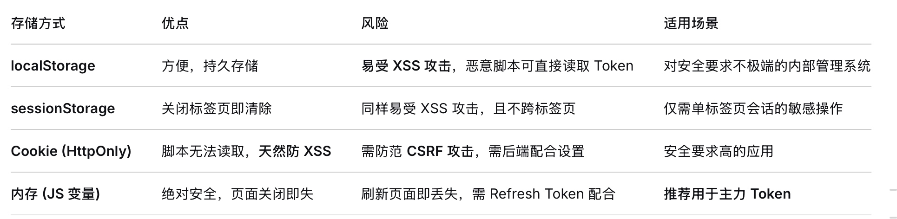
1. 最佳实践组合（安全与体验并重）：
    Access Token (短时效)：存在内存变量中（如 Pinia/Vuex 的 state）。
    Refresh Token (长时效)：存在 HttpOnly, Secure, SameSite=Strict 的 Cookie 中。
2. 原理：Access Token 用于日常请求，丢失只影响短期；Refresh Token 用于无感刷新，因 HttpOnly 保护不会被 JS 盗走。即使遭受 XSS，攻击者也拿不到 Refresh Token 去无限续期。
###### 2.前端权限控制的三大粒度
1. 路由/页面级 (Page Permission)
   这便是我们讨论的动态路由，由 router.beforeEach 守卫配合后端返回的路由表完成。这是第一道门，决定用户能不能进这个页面。
2. 按钮/功能级 (Element Permission)
痛点：没权限的用户进入了同一个页面，但他不应看到“删除”、“新增”等按钮。
实现方案：
1）v-permission 自定义指令：登录后拿到后端返回的权限标识数组（如 ['user:add', 'user:delete']），在 main.ts 注册一个全局指令。
`js
<el-button v-permission="'user:delete'">删除用户</el-button>
`
   指令内部判断当前权限列表是否包含此标识，没有则直接移除该 DOM 元素`(el.parentNode.removeChild(el))`，比 `v-if` 省去很多维护成本。
2）函数式权限检查：封装一个 checkPermission(perm) 函数，用在 JS 逻辑中。
3. 数据/接口级 (Data Permission)
概念：不是前端能独立解决的，需要前后端配合。比如“部门经理只能看自己部门的员工列表”。
前端职责：通常不需要前端在请求参数中显式传递“只看我的数据”这个条件，因为容易被篡改。规则应由后端根据当前登录用户的角色和部门信息，在 SQL 查询中强制执行。前端只需正常发请求。
###### 3.路由切换时的页面加载优化：路由懒加载与代码分割
当你的动态路由表映射了大量页面组件时，必须关注打包体积
1. 基础懒加载
```js
// 静态导入：所有用户一开始就下载了这个 chunk
// import UserList from '@/views/system/user.vue' 

// 动态导入：只有访问这个路由时，才去异步加载对应的 chunk
const UserList = () => import('@/views/system/user.vue');
```
3. 魔法注释（Magic Comments）
```js
// 将系统管理的三个子页面打包到一个叫 system-group 的 chunk 里
const viewsMap = {
  'system/user': () => import(/* webpackChunkName: "system-group" */ '@/views/system/user.vue'),
  'system/role': () => import(/* webpackChunkName: "system-group" */ '@/views/system/role.vue'),
  'system/menu': () => import(/* webpackChunkName: "system-group" */ '@/views/system/menu.vue'),
};
```
这样做的好处是，用户点击“系统管理”菜单时，相关的三个页面模块会被一次性加载下来，后续切换就在本地了，体验更流畅。
###### 4.路由守卫的三层联防
### 3. 自定义 Hook 提升代码复用
##### 需求分析
在前端开发中，表格数据的获取、分页、搜索等逻辑在多个组件中重复出现，需要一套可复用的解决方案。SmartPark项目中有多个表格页面，如用户管理、设备管理等，需要处理类似的逻辑。
##### 实现流程
首先将表格中数据的获取，分页，搜索等逻辑提取到自定义的useDataList函数中，在这里使用ts泛型，确保类型安全，使用useCallback和useEffect依赖项优化，减少不必要的重渲染（使用useCallback缓存loadData函数，避免不必要的重渲染，使用useEffect当loadData依赖项变化时重新加载数据）
```js
// src/hooks/useDataList.ts
type MyFormData = {
  [key: string]: string;
};

interface DataFetcher<T> {
  (args: T & { page: number; pageSize: number }): Promise<any>;
}

function useDataList<T extends MyFormData, U>(
  initialFormData: T,
  fetchData: DataFetcher<T>
) {
  const [dataList, setDataList] = useState<U[]>([]);
  const [page, setPage] = useState<number>(1);
  const [pageSize, setPageSize] = useState<number>(10);
  const [total, setTotal] = useState<number>(0);
  const [loading, setLoading] = useState<boolean>(false);
  const [formData, setFormData] = useState<T>(initialFormData);
  
  // 使用useCallback缓存loadData函数，避免不必要的重渲染
  const loadData = useCallback(async () => {
    setLoading(true);
    try {
      const {
        data: { list, total },
      } = await fetchData({ page, pageSize, ...formData });
      setDataList(list);
      setTotal(total);
    } catch (error) {
      console.log(error);
    } finally {
      setLoading(false);
    }
  }, [formData, page, pageSize, fetchData]);
  
  // 当loadData依赖项变化时重新加载数据
  useEffect(() => {
    loadData();
  }, [loadData]);
```
##### 优势
- 代码复用 ：封装了表格数据的通用逻辑，避免在多个组件中重复相同的代码
- 状态管理 ：集中管理表格相关的状态，使组件代码更简洁
- 性能优化 ：使用useCallback和useEffect依赖项优化，减少不必要的重渲染
- 类型安全 ：使用TypeScript泛型，提供类型安全的API
- 灵活性 ：支持自定义数据获取函数，适应不同的API需求
##### 解决的问题
- 代码重复 ：减少了表格数据管理的重复代码
- 状态管理混乱 ：集中管理表格相关的状态，使代码更清晰
- 性能问题 ：通过useCallback和useEffect优化，减少了不必要的重渲染
- 类型安全 ：使用TypeScript泛型，提供了类型安全的API
### 4. 复杂的表格与表单处理
企业级应用中，表格和表单是常见的交互元素，需要处理分页、搜索、批量操作、编辑等复杂功能。SmartPark项目中有多个表格页面，如用户管理、设备管理、财务管理等，需要实现完整的表格CRUD功能。
##### 实现流程
表格需要实现分页，搜索，批量操作，行内编辑等功能（使用useMemo优化计算，使用batchDeleteUser进行批量删除），表单需要实现表单验证，数据提交，编辑回显等功能，需要使用hooks管理表格和表单的状态，使用useCallback和useMemo等优化性能，添加加载状态，确认对话框等提升用户体验
###### 表格
```js
// src/page/users/index.tsx
function Users() {
    const [dataList, setDataList] = useState<DataType[]>([])
    const [page, setPage] = useState<number>(1);
    const [pageSize, setPageSize] = useState<number>(10);
    const [total, setTotal] = useState<number>(0)
    const [loading, setLoading] = useState<boolean>(false)
    const [selectedRowKeys, setSelectedRowKeys] = useState<React.Key[]>([])
    const [isModalOpen, setIsModalOpen] = useState<boolean>(false)
    const [title, setTitle] = useState<string>("")
    const dispatch = useDispatch()
    const [formData, setFormData] = useState({
        companyName: "",
        contact: "",
        phone: ""
    })
   
    // 使用useMemo优化计算
    const disabled = useMemo(() => {
        return selectedRowKeys.length ? false : true
    }, [selectedRowKeys])

    // 加载数据
    useEffect(() => {
        loadData()
    }, [page, pageSize])

    const loadData = async () => {
        setLoading(true)
        const { data: { list, total } } = await getUserList({ ...formData, page, pageSize });
        setLoading(false)
        setDataList(list)
        setTotal(total)
    }

    // 处理表单输入变化
    const handleChange = (e: React.ChangeEvent<HTMLInputElement>) => {
        const { name, value } = e.target;
        setFormData(prevState => ({
            ...prevState,
            [name]: value
        }))
    }

    // 处理表格行选择
    const onSelectChange = (selectedRowKeys: React.Key[]) => {
        setSelectedRowKeys(selectedRowKeys)
    }

    const rowSelection = {
        selectedRowKeys,
        onChange: onSelectChange
    }

    // 处理分页变化
    const onChange: PaginationProps['onChange'] = (page, pageSize) => {
       setPage(page)
       setPageSize(pageSize);
    }

    // 重置表单和分页
    const reset = () => {
        setSelectedRowKeys([]);
        setFormData({ companyName: "", contact: "", phone: ""})
        setPage(1)
        setPageSize(10);
        loadData()
    }

    // 删除操作
    const confirm = async function(id: string){
      const { data } = await deleteUser(id);
      message.success(data);
      loadData();
    }

    // 批量删除操作
    const batchDelete = async () => {
        const { data } = await batchDeleteUser(selectedRowKeys)
        message.success(data);
        loadData();
    }

    // 编辑操作
    const edit = (record: DataType) => {
        setIsModalOpen(true);
        setTitle("编辑企业");
        dispatch(setUserData(record))
    }

    // 新增操作
    const add = () => {
        setIsModalOpen(true);
        setTitle("新增企业");
        dispatch(setUserData({}))
    }

    // 隐藏模态框
    const hideModal = useCallback(() => {
        setIsModalOpen(false)
    }, [])

    // 表格列配置
    const columns: TableProps<DataType>['columns'] = [
        {
            title: "No.",
            key: "index",
            render(value, record, index) {
                return index + 1
            },
        },
        {
            title: "客户名称",
            key: "name",
            dataIndex: "name"
        },
        {
            title: "经营状态",
            key: "status",
            dataIndex: "status",
            render(value) {
                if(value == 1){
                    return <Tag color="green">营业中</Tag>
                }else if(value == 2){
                    return <Tag color="#f50">暂停营业</Tag>
                }else if(value == 3){
                    return <Tag color="red">已关闭</Tag>
                }
            }
        },
        // 其他列配置...
        </Card>
    </div>
}

const MyUserForm = React.memo(UserForm)
export default Users
```
###### 表单
```js
// src/page/users/userForm.tsx
import { editUser, addUser } from "../../api/userList";
import type { DataType } from "./interface";

interface UserFormProps {
  visible: boolean;
  hideModal: () => void;
  title: string;
  loadData: () => void;
}

function UserForm({ visible, hideModal, title, loadData }: UserFormProps) {
  const [form] = Form.useForm();
  const { userData } = useSelector((state: { userSlice: { userData: DataType } }) => state.userSlice);

  // 当userData变化时，更新表单数据
  useEffect(() => {
    form.setFieldsValue(userData);
  }, [userData, form]);

  // 处理表单提交
  const handleSubmit = async () => {
    try {
      const values = await form.validateFields();
      let result;
      if (userData.id) {
        // 编辑模式
        result = await editUser(values);
      } else {
        // 新增模式
        result = await addUser(values);
      }
      message.success(result.data);
      hideModal();
      loadData();
    } catch (error) {
      console.log(error);
    }
  };

  return (
    <Modal
      title={title}
      open={visible}
      onCancel={hideModal}
      footer={[
        <Button key="cancel" onClick={hideModal}>
          取消
        </Button>,
        <Button key="submit" type="primary" onClick={handleSubmit}>
          确定
        </Button>,
      ]}
    >
      <Form form={form} layout="vertical">
      </Form>
    </Modal>
  );
}

export default UserForm;
```
##### 优势
- 完整的表格功能 ：实现了分页、搜索、批量操作、行内编辑等功能
- 完善的表单处理 ：实现了表单验证、数据提交、编辑回显等功能
- 良好的用户体验 ：添加了加载状态、确认对话框等提升用户体验
- 性能优化 ：使用useMemo、useCallback等React Hooks优化性能
- 代码结构清晰 ：逻辑分明，易于维护
##### 解决的问题
- 表格功能复杂 ：实现了完整的表格CRUD功能
- 表单处理繁琐 ：实现了表单验证、数据提交、编辑回显等功能
- 用户体验差 ：添加了加载状态、确认对话框等提升用户体验
- 代码结构混乱 ：使用React Hooks管理状态，代码结构清晰
### 5. 闭包+HOC按钮权限控制
##### 需求分析
在企业级应用中，除了路由级别的权限控制外，还需要更细粒度的按钮级别权限控制，确保用户只能看到和使用有权限的按钮。SmartPark项目中，不同角色的用户需要不同的操作权限，如管理员可以删除用户，而普通用户不能。
##### 实现流程
使用高阶组件封装权限检查逻辑，利用闭包保存权限配置，进行权限检查，根据用户的权限决定是否显示按钮，同时支持多个权限的组合检查
###### 高阶组件实现
```js
// src/utils/withPermissions.tsx
// 你所拥有的权限 当前按钮所需要的权限  
function withPermissions(requiredPermissions: string[], userPermissions: string[]): (Component: React.FC) => React.FC {
    // 返回一个高阶组件
    return function(Component: React.FC) {
        // 返回一个新组件
        return function(props: any): React.ReactElement | null {                     
            // 检查用户是否拥有所有必需的权限
            const hasPermission: boolean = requiredPermissions.every(item => userPermissions.includes(item));
            if (!hasPermission) {
                // 没有权限，返回null，不渲染组件
                return null
            }
            // 有权限，渲染原始组件
            return <Component {...props}/>
        }
    }
}

export default withPermissions
```
使用示例
```js
// 示例：使用withPermissions HOC
import withPermissions from '../../utils/withPermissions';
import { Button } from 'antd';
import { useSelector } from 'react-redux';

function UserActions({ record, onEdit, onDelete }) {
  // 从Redux中获取用户权限
  const { btnAuth } = useSelector((state: { authSlice: { btnAuth: string[] } }) => state.authSlice);

  // 创建需要特定权限的按钮组件
  const EditButton = withPermissions(['edit'], btnAuth)(({ onClick }) => (
    <Button type="primary" size="small" onClick={onClick}>编辑</Button>
  ));

  const DeleteButton = withPermissions(['delete'], btnAuth)(({ onClick }) => (
    <Button type="danger" size="small" onClick={onClick}>删除</Button>
  ));

  return (
    <div>
      <EditButton onClick={() => onEdit(record)} />
      <DeleteButton onClick={() => onDelete(record.id)} />
    </div>
  );
}
```
##### 优势
- 细粒度权限控制 ：实现了按钮级别的权限控制，比路由级别的权限控制更精细
- 代码复用 ：通过高阶组件封装权限检查逻辑，减少重复代码
- 灵活性 ：可以根据不同的权限需求创建不同的组件
- 可读性 ：代码结构清晰，权限控制逻辑与业务逻辑分离
- 类型安全 ：使用TypeScript类型定义，提供类型安全的API
##### 解决的问题
- 权限控制不精细 ：实现了按钮级别的权限控制，比路由级别的权限控制更精细
- 代码重复 ：通过高阶组件封装权限检查逻辑，减少了重复代码
- 权限逻辑分散 ：集中管理权限检查逻辑，提高了代码的可维护性
- 用户体验差 ：用户只能看到有权限的按钮，界面更简洁明了

# sp文档更新
### 1.原子化骨架屏组件体系消除首屏白屏
#### 简述
设计原子化骨架屏组件体系，拆分为 Skeleton、SkeletonAvatar、SkeletonParagraph 等独立原子，封装 PageSkeleton 提供 form/list/detail/dashboard 四种预设布局，配合 React.lazy 与 Suspense实现按需加载时骨架屏作为 fallback 无缝衔接，消除首屏白屏
#### 为什么做？
#### 简单讲一下怎么做的？
#### 实现
在components文件夹中创建skeleton组件体系，组件架构：
```
src/components/skeleton/
├── index.tsx              # 导出入口
├── index.scss             # 共享样式
├── SkeletonAvatar.tsx     # 原子组件：头像占位
├── SkeletonParagraph.tsx  # 原子组件：段落占位
└── PageSkeleton.tsx       # 预设布局组件
```
原子组件有两个，SkeletonAvatar组件用于头像/图片的占位，props有size，shape，width等等，SkeletonParagraph组件用语文本行的占位，props有rows ，width等等
封装PageSkeleton组件进行预设布局，主要类型有form（表单：标签+输入框行，按钮），list（列表：头像+内容卡片列表），datail（详情页：大图+信息行），dashboard（仪表盘页面：统计卡片图表区域）
与React.lazy+Suspense集成，在`src/utils/generatesRoutes.tsx`文件中自动根据路由路径匹配骨架屏类型，Suspense fallback使用PageSkeleton组件进行渲染

### 2.封装组件支持防抖与节流双模式切换
#### 简述
封装 SafeButton 组件支持防抖与节流双模式切换，智能识别 Promise 异步回调自动进入 Loading 阻断重复操作，核心逻辑抽离为 useDebounce、useThrottle 通用 Hook，支持函数与值两种场景，实现交互层防御性编程
#### 为什么做？
这个功能是我在做云园区管理平台时沉淀出来的。当时财务模块的批量删除和导出按钮、租户列表的搜索框，都存在重复点击或者频繁触发的问题。如果每个按钮都单独写防抖或者节流逻辑，代码会很分散，维护起来也容易漏。
项目里有大量按钮需要防重复点击，搜索框需要防抖，如果不用这种双模式方案，要么每个地方单独写逻辑，要么硬套同一种策略导致场景不适配。还有就是是防御性编程思想的落地，前端不能假设用户按规则操作，得从交互层面就阻断误操作，按钮点了就该有反馈且不能重复触发，同时loading状态下自动禁用也能避免接口压力。把通用逻辑抽成Hook和组件后，新页面接入只需要几行配置，不需要重复写防重逻辑，这个组件在项目里至少接了六七个模块。
#### 简单讲一下怎么做的？
我把频率控制能力抽成了可复用的基础设施，分两层来实现。
这个功能实现的底层是两个通用Hook。分别是useDebounce和useThrottle。useDebounce用于搜索输入这类要等用户操作稳定后再触发的场景，核心是每次调用清掉上一个定时器重新计时，等安静期过了才执行。useThrottle用于按钮点击、滚动事件这类要持续响应但不能太密集的场景，核心是用时间戳判断距离上次执行是否超过指定间隔，到了就放行，不到就忽略。
上层是SafeButton组件来做统一入口。组件接收一个mode属性，内部根据mode自动选择走防抖还是节流，调用方只需要传一个字符串就能切换策略。同时做了三层保护：第一层是前置校验，通过onBeforeClick回调可以在执行前拦截，比如表单没通过校验就直接返回false阻断。第二层是频率控制，把点击事件交给对应的Hook处理，由它按规则决定是立即执行还是延迟等待。第三层是异步状态管理，组件自动识别点击函数的返回值是不是Promise，如果是异步操作就自动把按钮置为loading状态并禁用，Promise结束后再恢复，从UI层面彻底杜绝了用户连点重复提交的可能。
#### 实现
```
src/
├── hooks/
│   ├── index.ts          # Hook 导出入口
│   ├── useDebounce.ts    # 防抖 Hook（函数+值）
│   └── useThrottle.ts    # 节流 Hook（函数+值）
└── components/
    └── SafeButton/
        └── index.tsx     # SafeButton 组件
```
##### 封装Hook：
###### 防抖：
第一个Hook：useDebounce
useDebounce(fn, options)，这个Hook的作用是对函数做防抖处理，也就是延迟执行函数，适合搜索输入、表单校验这类场景。
对于useDebounce函数防抖，内部通过useRef持久化存储一个定时器ID和一个leading标志位。每次调用返回的防抖函数的时候，首先检查并清除上一次的定时器，以此实现“频繁调用只保留最后一次”的核心防抖逻辑。如果配置了leading模式且是新一轮的首次调用，则会立即执行原函数并跳过定时器等待，否则设置一个新的定时器，在延迟结束后根据trailing配置决定是否执行原函数。整个调用过程通过Promise包装返回值，使得同步函数和异步函数的调用结果都能被await统一处理。组件卸载时通过useEffect的清理函数清除未执行的定时器，防止内存泄漏。

第二个Hook：useDebounceValue
useDebounceValue(value, wait)，这个Hook的作用是对值做防抖处理，适合搜索输入框场景。
对于useDebounceValue值防抖，实现更为直接，通过useState维护一个稳定的输出值，在useEffect中监听原始值的变化，每次变化时设置定时器，若延迟期间原始值再次变化，清理函数会清除上一次的定时器并重新计时，确保只有在原始值停止变化达到指定延迟时间后，才将最新值更新到状态中。两者的本质差别在于一个处理函数的执行，一个处理值的同步。

**有两个开发过程中需要注意的点：**
第一个点是返回Promise的设计。常规的防抖函数通常只是延迟执行，不关心返回值，但这里用Promise把异步执行的结果抛给了调用方，这样调用方既可以按普通回调方式使用，也可以用await等待结果，使用上更灵活。
第二个点是leading和trailing的双模式支持。这参考了Lodash里防抖函数的设计思路。leading适合“先执行再等待”，比如按钮点击，第一次点击要立即响应，但后续快速连点要忽略；trailing适合“等稳定后再执行”，比如搜索输入，等用户停手了再发请求。两者可以组合使用。
###### 节流：
节流的核心思想不是"取消上一次"，而是"根据时间间隔决定是否执行"。也就是说，在指定的wait时间窗口内，无论调用多少次，最多只执行一次。默认配置下，leading为true表示首次调用立即执行，trailing为false表示不在时间窗口末尾补一次执行。

第一个Hook：useThrottle
useThrottle(fn, options)，这个Hook的作用是对函数做节流处理，适合快速点击按钮场景。
实现上用了三个Ref来持久化状态。timerRef存定时器ID，用于处理尾部调用。lastTimeRef记录上一次实际执行的时间戳，这是判断是否达到时间间隔的依据。pendingArgsRef暂存最近一次调用的参数，当尾部调用触发时拿出来使用。
核心判断逻辑分三步。第一步处理leading模式，如果lastTimeRef的值为零，说明是首次调用，立即执行原函数，同时将当前时间戳写入lastTimeRef作为基准，后续调用都以此计算间隔。第二步是主判断，计算当前时间与上一次执行时间的差值，如果大于等于wait，说明已经过了节流周期，清理可能存在的尾部定时器，更新lastTimeRef并执行原函数。第三步处理trailing模式，当间隔不足且没有正在等待的尾部定时器时，设置一个定时器，延迟时间为wait减去已经过去的时长，到期后执行最近一次缓存的参数。
返回值同样用Promise包裹，让同步函数和异步函数的调用结果都能被统一await处理。组件卸载时通过useEffect清理未执行的定时器。

第二个Hook：useThrottleValue
useThrottleValue(value, wait)，这个Hook的作用是对值做节流处理，适合滚动事件场景。
这个Hook更简单，直接对值做节流控制。内部用useState存稳定输出值，用lastTimeRef记录上一次更新时间戳。在useEffect中每次原始值变化时，判断当前时间与上一次更新时间的差值，只有超过wait才更新输出值并刷新时间戳，否则忽略这次变化。
##### 防抖和节流的核心区别：
两者的核心区别在于处理策略。 防抖是每次调用都重置计时器，等安静下来才执行，适合输入搜索这种关注最终结果的场景。节流是固定时间窗口内最多执行一次，到点就放行，不重置也不等待，适合滚动监听、按钮点击这些需要持续响应但不能过于频繁的场景。节流的leading模式保证了用户操作的即时反馈，而防抖的定时器重置机制则过滤掉了中间过程。
##### SafeButton安全按钮组件封装
其实就是封装了一个带防抖和节流保护的安全按钮组件，核心流程是将按钮点击事件的处理分为三个阶段来控制：前置校验、防抖或节流保护、以及异步状态的自动管理。

首先，组件接收mode属性来决定使用防抖还是节流策略，默认是防抖模式。在内部，它根据这个模式选择对应的Hook，也就是之前封装的useDebounce或useThrottle，并把原始点击事件传入，得到一个被包装过的增强点击函数。

然后，当用户真正点击按钮时，会走一个分步的处理流程。第一步是前置校验，如果传入了onBeforeClick回调，就先执行它，当回调返回false时就中止整个点击流程，不往下执行。第二步，把点击事件交给增强点击函数处理，这个函数会根据配置的防抖或节流规则来决定是立即执行还是延迟等待。第三步，拿到增强函数的返回值后，组件会智能判断这个返回值是不是Promise。如果是异步函数，就自动将按钮置为loading状态，等Promise完成后再关闭loading，这样就不需要外部手动管理loading了。如果不是Promise，就直接当作同步结果处理。无论成功还是失败，最后都会通过onAfterClick回调通知外部执行结果。

整个实现把点击频率控制、loading状态管理、异常处理这些通用逻辑封装在了组件内部，使用的时候只需要传入点击函数和选择模式，按钮就能自动具备防抖或节流保护以及异步加载状态的能力。

### 3.在 HTTP 请求层实现三重优化，二次封装 Axios 拦截器
#### 简述
在 HTTP 请求层实现请求防抖、TTL 响应缓存、并发请求合并三重优化，封装 cachedGet 命中缓存，基于 pendingRequests Map 消除并发重复调用；二次封装 Axios 拦截器集中实现 Token 注入与 401/403/500 异常链路阻断，消除散落错误处理
#### 为什么做？
在HTTP请求层做这三重优化，是为了把接口调用中反复出现的通用问题统一处理掉，避免每个业务页面各自为战。管理平台这个项目的接口量大，很多页面同时存在重复提交、相同数据重复请求、以及Token过期处理的需求，如果只在组件层处理，不仅代码分散，还容易遗漏，所以我把能力下沉到了请求层。
#### 简单讲一下怎么做的？
具体实现是在Axios实例上扩展了三项能力。第一是请求防抖，通过debounceTimers这个Map维护每个请求对应的定时器，相同的请求在指定时间内再次触发时，先清除旧定时器再重新计时，等安静期过了才真正发出，适合搜索框这类场景。第二是TTL响应缓存，通过cacheStore这个Map存储GET请求的返回数据和时间戳，后续相同请求先检查缓存是否在有效期内，在的话直接返回缓存数据，省掉了网络开销。第三是并发请求合并，通过pendingRequests这个Map记录正在飞行中的请求，短时间内相同请求到来时，不发起新请求，而是直接复用已有请求的Promise，等结果回来后同步分发给所有调用方，做到多次调用只发一次真实请求。

基础层部分，在Axios拦截器里统一处理了Token注入和异常链路阻断。请求拦截器从Redux中取出Token写入Authorization头，保证每个请求都携带身份凭证。响应拦截器按状态码分层处理，401强制退出到登录页，403提示权限不足，500提示服务器错误，其他业务错误码统一弹消息提示，网络层面的超时和连接失败也有兜底提示，形成了一条从认证到异常反馈的完整链路。
#### 实现
```
src/utils/http/
├── http.ts       # 核心增强模块
└── request.ts    # API 导出
```
在标准Axios实例之上，通过请求拦截器、响应拦截器和三个增强方法，构建了一套完整的请求治理方案。我从基础层和增强层两部分来解释具体实现。
##### 基础层：Axios实例创建与拦截器
先用axios.create创建了一个统一实例，配置了baseURL、超时时间和默认请求头。这样后续所有请求都从这个实例发出，基础配置只需维护一处。

请求拦截器做了Token注入。每次请求发出前，从Redux的authSlice中取出token，写入请求头的Authorization字段，格式是Bearer加空格加token值。如果token不存在或headers不可用，就跳过注入，不会阻断公开接口的调用。

响应拦截器处理了两类情况。成功响应走业务状态码判断，根据code字段分别处理401登录过期、403权限不足、500服务器错误，以及其他非正常业务错误，每种情况都给出对应的用户提示并返回reject。正常响应则返回data字段，把外层包装剥离掉，让调用方直接拿到业务数据。失败响应按网络错误、HTTP状态码错误、超时错误分层兜底，每种错误都有对应的中文提示。其中通过axios.isCancel识别被AbortController取消的请求，这类不做错误提示，避免正常取消操作被当成异常处理。

##### 增强层：三项优化能力
cachedGet方法实现了TTL缓存和并发请求合并两项能力。首先根据method、url、params和data生成一个唯一的请求key，作为缓存的标识。然后查cacheStore这个Map，如果命中缓存且未过期，直接返回缓存数据，完全不发请求。接着查pendingRequests这个Map，看是否有相同key的请求正在进行中，如果有就直接返回那个请求的Promise，做到多次调用复用同一个真实请求。只有缓存未命中且没有在途请求时，才创建新的请求发出去，同时把请求Promise和对应的AbortController存入pendingRequests。请求完成后在finally块中从pendingRequests移除，并把响应数据存入cacheStore，记录存入时间戳和TTL时长。

debouncedRequest方法实现了请求级防抖。同样先生成请求key，然后在debounceTimers这个Map中查找是否已有定时器。如果有就先清除，这是防抖的核心，每次新调用都重置计时器。然后根据immediate参数决定执行策略：如果是leading模式就立即调用http.request发请求；否则设置一个新的定时器，延迟指定时间后发出。定时器的ID存入debounceTimers，供下次调用时清除。

辅助方法提供了缓存和防抖定时器的手动清理能力。clearCache支持按url模糊匹配清除部分缓存或全部清空。clearPendingRequest不仅从Map中移除记录，还会调用对应AbortController的abort方法真正取消在途请求，避免内存中残留无效连接。clearDebounceTimers遍历所有定时器并清除，一般用于页面卸载时做全局清理。


### 4.封装LazyImage 与 VirtualList
#### 简述
封装基于 IntersectionObserver 的 LazyImage 与 VirtualList，仅渲染可视区域 DOM，削减首屏无效请求与重排开销，显著提升长列表及图片密集场景的首屏渲染性能
#### 为什么做？

#### 简单讲一下怎么做的？

#### 实现
```
src/components/
├── LazyImage/
│   ├── index.tsx    # 懒加载图片组件
│   └── index.scss   # 样式文件
├── VirtualList/
│   ├── index.tsx    # 虚拟列表组件
│   └── index.scss   # 样式文件
└── index.ts          # 统一导出
```